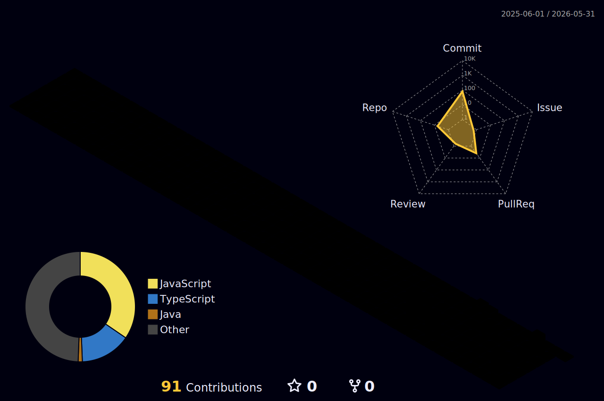

# Not just another 'GitHub' Profile

---
`Aspiring Full-Stack Developer | Competitive Programmer | Speed Cuber`
---

- **CSE Student @ SSN College of Engineering**
- Building **Full-Stack Applications that solve real problems I encounter**
- Writing **Clean, efficient, and scalable systems** out of my sheer interest
- Curious about **System design, backend architecture and modern developer tools**

---

## Tech Stack

---

## GitHub Analytics

  

---

## GitHub Skyline

  

 

---

## Let's Connect

---

## Beyond Code

Speedcubing is where my fascination with <b>algorithms, optimization, and pattern recognition</b> first began.
Much like programming, solving a cube is about discovering the <b>most efficient sequence of moves</b> to transform chaos into perfectly matching colors!

- <b>Method:</b> CFOP
- <b>Personal Best:</b> Sub 10 (9.69s)
- <b>Average of 5:</b> Sub 16 (15.59s)
- <b>Creator of:</b> <a href="https://www.youtube.com/channel/UC0vpldu75y4_hAtjTdGeumA" target="_blank">Callofcubes</a> — My SpeedCubing YT Channel

---

